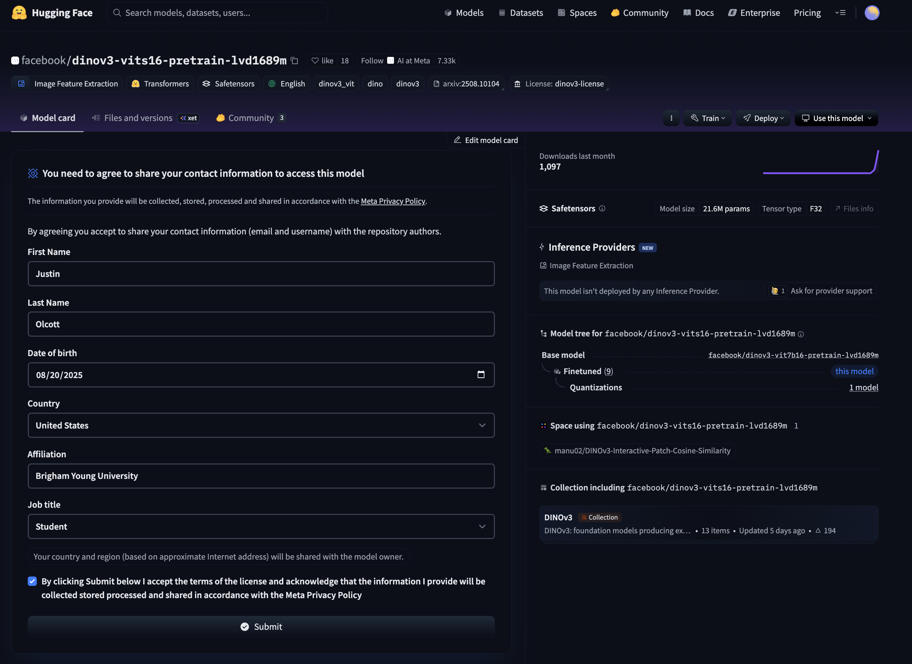
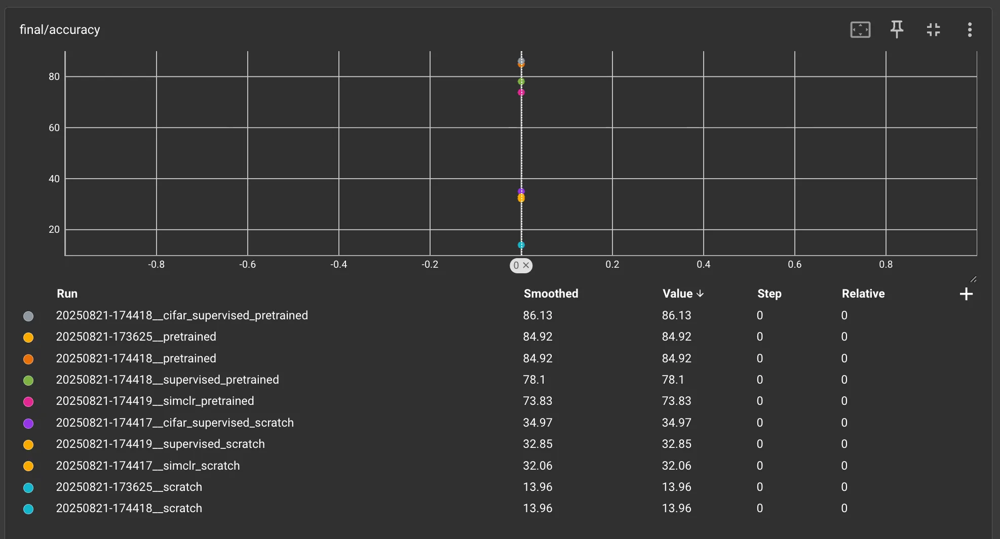

# CS 674 Lab 1

# 1 Getting Acquainted

## 1.1 Supercomputer

### 1.1.1 Requesting an Account

1. Request an account if you do not already have one: [https://rc.byu.edu/](https://rc.byu.edu/)
2. Please use Dr. Wingate as your sponsor. His username is  `dw87` if needed.

### 1.1.2 Login Nodes

1. The supercomputer contains login and compute nodes. Login nodes have internet access and are used to prepare compute jobs for submission. You can think of login nodes as being CPU machines with internet access. This is also where you will submit jobs using Slurm.
2. You can login to the supercomputer by following the instructions here: [https://rc.byu.edu/wiki/?id=Logging+In](https://rc.byu.edu/wiki/?id=Logging+In) or `ssh username@ssh.rc.byu.edu`.
3. Two-factor authentication is required; however SSH multiplexing will make it easier: [https://rc.byu.edu/wiki/index.php?page=SSH+Multiplexing](https://rc.byu.edu/wiki/index.php?page=SSH+Multiplexing).
4. VS Code can be used by installing the ‘Remote Development’ pack by Microsoft. Going to ‘Remote Explorer side tab’ > SSH > Settings and adding:
    
    ```bash
    Host orc
        User username
        HostName ssh.rc.byu.edu
    ```
    
    To login, you can simply use `ssh orc` .
    
5. MacOS users can use SSH multiplexing to avoid having to do two-factor authentication every time by adding:
    
    ```bash
    Host orc
        User username
        HostName ssh.rc.byu.edu
        ControlMaster auto
        ControlPath ~/.ssh/master-%r@%h:%p.socket
        ControlPersist yes 
        ForwardX11 yes
        ServerAliveInterval 300
        XAuthLocation /opt/X11/bin/xauth
    ```
    
6. See this link to learn more about storage on the supercomputer: [https://rc.byu.edu/wiki/?id=Storage](https://rc.byu.edu/wiki/?id=Storage).

### 1.1.3 Compute Nodes

1. Compute nodes do not have access to the internet which means that data and models need to be downloaded beforehand and logging needs to be done offline.
2. Compute nodes can be used in either two ways: interactively or through jobs. Submitting jobs is preferred as letting GPUs sit idle while developing is inefficient. For reference, an A100 GPU costs ~$1.29 on [https://lambda.ai/pricing#on-demand](https://lambda.ai/pricing#on-demand).
3. Compute nodes can be used interactively by salloc-ing a node with:
    
    ```bash
    salloc --time=4:00:00 --qos=dw87 --gpus=1 --mem=32G --cpus-per-gpu=8
    ```
    
4. Jobs can be submitted using `sbatch` (preferred):
    
    ```bash
    sbatch script.sh
    ```
    
    In this example, arguments can be added in the command line or in the top of the .sh file like:
    
    ```bash
    #SBATCH --job-name=simclr_one
    #SBATCH --output=slurm_logs/%x_%j.out
    #SBATCH --gres=gpu:a100:1
    #SBATCH --cpus-per-task=8
    #SBATCH --mem=32G
    #SBATCH --time=04:00:00
    #SBATCH --qos=dw87
    ```
    
5. A list of jobs can be found using `squeue` which can be useful when paired with `squeue | grep username` or `squeue -u username`.
6. Jobs can be canceled using `scancel JOBID` or `scancel -u username` to cancel all your jobs.

## 1.2 Recommendation for Deep Learning Workflows

1. The general workflow for deep learning can be summarized by starting small and slowly scaling up while being able to iterate quickly.
2. For me, this means starting with a Jupyter Notebook on a CPU or small GPU. This is where I figure out the data, model, and evaluation. I’ll also start with a small model and data.
3. Once I’m at a good spot, I will transition to compute nodes by submitting small jobs and debugging issues that arise such as environment inconsistencies or CUDA errors. If the logs aren’t enough or if I’m consistently running into problems, I will ssh into the compute node of a running job or interact with a compute node directly. Sometimes, job queues can back up which might require salloc-ing a node to debug final errors so that when your job eventually gets executed, it will be successful.   
4. The last recommendation is to begin with the entire workflow in mind which means thinking about the data, model, training, evaluation, loss, and logging throughout.

## 1.3 Huggingface

[huggingface.co](http://huggingface.co) 🤗 is a platform which hosts models and datasets. Relevant libraries to use huggingface include `transformers` and `datasets`. Some models require access to use.

1. You can start by requesting access to: [https://huggingface.co/facebook/dinov3-vits16-pretrain-lvd1689m](https://huggingface.co/facebook/dinov3-vits16-pretrain-lvd1689m) which is the first model we will be using in class.

Models which require granted access will then require you set the environment variable `HF_TOKEN` to your huggingface token which can be made here: [https://huggingface.co/settings/tokens](https://huggingface.co/settings/tokens). I suggest just making a write token. Make sure to never commit this token or expose it. Be sure to delete tokens after use.

## 1.4 PyTorch

PyTorch is an open-source machine learning library developed and maintained by Meta. PyTorch will be used extensively throughout this class and will require prerequisite knowledge. Please consider CS 474 Deep Learning if you’re unfamiliar with PyTorch, Jax, Tensorflow, or similar machine learning library.

## 1.5 Other

Many other libraries will be used as part of this class including, but not limited to tensorboard, wandb, jax, uv, and others.

# 2 Introduction to SimCLR

This lab will focus on implementing and replicating results from the SimCLR paper: [https://arxiv.org/abs/2002.05709](https://arxiv.org/abs/2002.05709) and relevant repository:  [https://github.com/sthalles/SimCLR](https://github.com/sthalles/SimCLR). This repository is 5 years old, so fortunately, we have made a new repository!

## 2.1 SimCLR Lab Structure

1. The goal of this lab will be to reproduce the results of the SimCLR paper which is to show that unsupervised learning on an image task using contrastive learning is comparable to supervised learning.
2. In this lab, we will use the new DinoV3 Small ViT model as our architecture. Feel free to learn more about DinoV3, ViTs, and ConvNexts. [https://arxiv.org/abs/2508.10104](https://arxiv.org/abs/2508.10104) [https://arxiv.org/abs/2010.11929](https://arxiv.org/abs/2010.11929) [https://arxiv.org/abs/2201.03545](https://arxiv.org/abs/2201.03545)
3. Our goal is achieve the highest accuracy on cifar 100 which contains 100 classes. We have a few approaches:

    a. Train end to end on CIFAR 100 data and evaluate using the test set.

    b. Use an off the shelf pretrained model like DinoV3.
        1. Extract internal representation / features for the CIFAR100 dataset and train a linear classifier using those features and evaluate using the test set.

    c. Pretrain a model using a labeled dataset with supervised learning like ImageNet. 
        1. Extract internal representations, train, and evaluate on CIFAR 100.

    d. Pretrain a model using an unlabeled dataset with contrastive learning like ImageNet (with no labels).
        1. Extract internal representations, train, and evaluate on CIFAR 100.

5. We have provided a working example of end to end training on CIFAR 100 [a].
6. Your first step will be to run [b] by using the function `evaluate_linear_head` (no coding needed, just run a script to ensure things are working).
7. Your next step will be to run [c] by using the class `SupervisedModel` (no coding needed).
8. You next step will be to complete [d] by implementing… (start coding)
    1. the model class `SimCLRModel`
    2. the dataset helper function `get_simclr_transform(size)` 
    3. the criterion class `NTXentLoss`
9. In the end, you will have trained all the above models and obtained final accuracies.
10. For your convenience, you really only need to make sure your environment and training is working, complete [d] by implementing the 3 parts, and run the script to submit all jobs at once (to avoid waiting for the other jobs finish before you start coding).

## 2.2 Clone the Repo

1. `ssh orc` to login to the supercomputer after making an ORC account and following the instructions above.
2. `git clone https://github.com/BYU-PCCL/advanced-deep-learning.git`
3. `cd simclr`
4. This repository is uses `uv` which is a Python package and project manager, written in Rust [https://docs.astral.sh/uv/](https://docs.astral.sh/uv/). It is an extremely fast alternative to `pip`. You can install it with: `curl -LsSf [https://astral.sh/uv/install.sh](https://astral.sh/uv/install.sh) | sh`. `uv` manages dependencies in the `pyproject.toml` file. With PyTorch, different packages are used depending on the environment, so additional specifications in `pyproject.toml` are added to ensure we are using the correct version. You can learn more here: [https://docs.astral.sh/uv/guides/integration/pytorch/](https://docs.astral.sh/uv/guides/integration/pytorch/).

## 2.3 Setup

1. Request access to [https://huggingface.co/facebook/dinov3-vits16-pretrain-lvd1689m](https://huggingface.co/facebook/dinov3-vits16-pretrain-lvd1689m) which will take a few minutes to process. Copy your `HF_TOKEN` while you’re there.



1. Make a `.env` file with your huggingface token set with `HF_TOKEN=` as seen in the `.env.template` example. You can make a token here: [https://huggingface.co/settings/tokens](https://huggingface.co/settings/tokens).
2. Download the model and data (which happens to also create a `.venv` environment by running: `uv run src/setup.py`. This will download the `cifar100` data, `tiny-imagenet-200` data, and the `DinoV3` model. It might take >10 minutes to download and extract the dataset. Please remember to delete the datasets after.
    1. The compute nodes of the supercomputer do not have internet access, so the environment needs to be created and configured correctly before. `torch` can be quite finicky as it is dependent on its environment. In the `pyproject.toml`, I’ve specified the CUDA 12.8 index to be used which might result in the project not working on the login node / cpu. I’m open to good solutions via pull requests.
    2. On the same note, the login node does have a GPU; however, it is not usable. To ensure that login node scripts use the CPU, set `CUDA_VISIBLE_DEVICES=""`.

## 2.4 Submitting Jobs

1. Once the model, data, and environment are downloaded, we are ready to submit a job.
2. `src/main.py` is our entry point and requires a `--training_mode` and `--run-name`. Most of the steps are already completed. The simclr will require work on your part. Also, scratch just means we reinitialize weights before training.
    - [x]  `pretrained` [linear classifier post training]
    - [x]  `scratch` [reinitialized weights][linear classifier post training]
    - [ ]  `simclr_scratch` [reinitialized weights][simclr on imagenet][linear classifier post training]
    - [x]  `supervised_scratch` [reinitialized weights][supervised on imagenet][linear classifier post training]
    - [ ]  `simclr_pretrained` [simclr on imagenet][linear classifier post training]
    - [x]  `supervised_pretrained` [supervised on imagenet][linear classifier post training]
    - [x]  `cifar_supervised_pretrained` [trained end to end on cifar100]
    - [x]  `cifar_supervised_scratch` [reinitialized weights][trained end to end on cifar100]
3. These modes are made up from a combination of reinitializing weights, training paradigm, and whether the model is first pretrained on imagenet with a linear classifier head trained on cifar100 after (with rest of the model being frozen) or the model is trained end to end on cifar100.
4. You can run a quick test using CPU with: `CUDA_VISIBLE_DEVICES="" uv run src/main.py --training_mode cifar_supervised_scratch --run-name cpu_test` . ^C after a few steps. This is only a simple check to ensure we can load the model, cifar data, and train. CUDA_VISIBLE_DEVICES="" ensures we are running on CPU. CUDA_VISIBLE_DEVICES="0,1,2,3" is an example of exposing GPUs 0-3. The GPU on the login node will not work.
5. You can submit a job with `sbatch --job-name cifar_supervised_scratch ./scripts/sbatch_one.sh --mode=cifar_supervised_scratch`. Ensure that this is working by running the script and check the logs are clear of errors.
    1. This script contains a lot of pieces, but the main parts are the shebang, sbatch arguments, activating the environment, and running the script with the correct arguments.
6. You can submit all jobs with `./scripts/sbatch_all.sh`. Don’t do this yet.
    1. This submits a job for all modes. All the modes are not ready yet, but it can provide some detail as to submitting jobs.

## 2.5 Monitoring Jobs

1. You can monitor your job status with `squeue`.
    1. You can cancel jobs with `scancel`.
2. You can look into your `slurm_logs` to see the output of the different jobs.
3. You can use `tensorboard` to view the loss and accuracies with this command: `uv tool run tensorboard --logdir=outputs/runs/ --host=0.0.0.0 --port=6006`.

# 3 Pretrained Model

1. We have implemented the function `evaluate_linear_head`:
    1. First, we extract features for the train and test splits of the CIFAR 100 dataset.
    2. Then, we train and evaluate a linear classifier model on these features.
2. To check if it's working, train and evaluate the model with `sbatch --job-name pretrained ./scripts/sbatch_one.sh --mode=pretrained` and ensure the logs are clear of errors. We can now use and evaluate a pretrained model.

# 4 Supervised Learning

1. Next, let’s pretrain our own model by using the class `SupervisedModel`  which will be used to first train a model on ImageNet, and then use it on CIFAR 100.
    1. This class takes a backbone and adds a linear classifier head. The classifier head will take in a vector for an image and output logits in the dimension of number of classes.
    2. It uses the CLS token which you can find by reading this model doc: [https://huggingface.co/docs/transformers/main/en/model_doc/dinov3](https://huggingface.co/docs/transformers/main/en/model_doc/dinov3)
2. Train and evaluate the model with `sbatch --job-name supervised_scratch ./scripts/sbatch_one.sh --mode=supervised_scratch`.

# 5 Unsupervised Learning [Start Coding]

1. Implement the model class: `SimCLRModel`
    1. Instead of a classifier head, add a projection head as defined in section 2.1 of [https://arxiv.org/pdf/2002.05709](https://arxiv.org/pdf/2002.05709). You can run `uv run src/main_test.py` to test whether the shapes match.
2. Implement the criterion class `NTXentLoss` which returns the loss also defined in section 2.1. You can run `uv run src/main_test.py` to test whether the loss is lower for similar vectors.
3. Implement the dataset helper function `get_simclr_transform(size)`  which returns a random transformation using torch vision transforms. You can learn more about it here, but it's important to include the other augmentations mentioned in the paper. [https://docs.pytorch.org/vision/main/auto_examples/transforms/plot_transforms_getting_started.html#sphx-glr-auto-examples-transforms-plot-transforms-getting-started-py](https://docs.pytorch.org/vision/main/auto_examples/transforms/plot_transforms_getting_started.html#sphx-glr-auto-examples-transforms-plot-transforms-getting-started-py)
4. Train and evaluate the model with `sbatch --job-name simclr_scratch ./scripts/sbatch_one.sh --mode=simclr_scratch` .

# 6 Conclusion

At this point, all modes should be implemented and you can run:  `./scripts/sbatch_all.sh` which will generate a similar tensorboard as below. Screenshot and turn this in.


